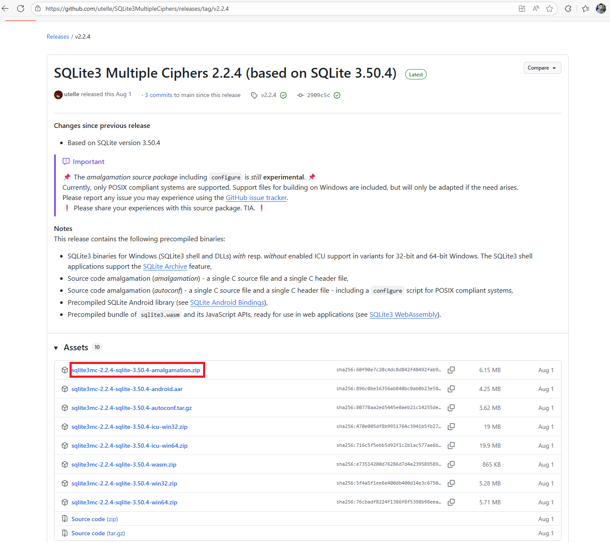
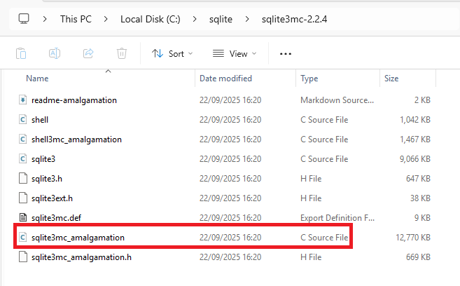
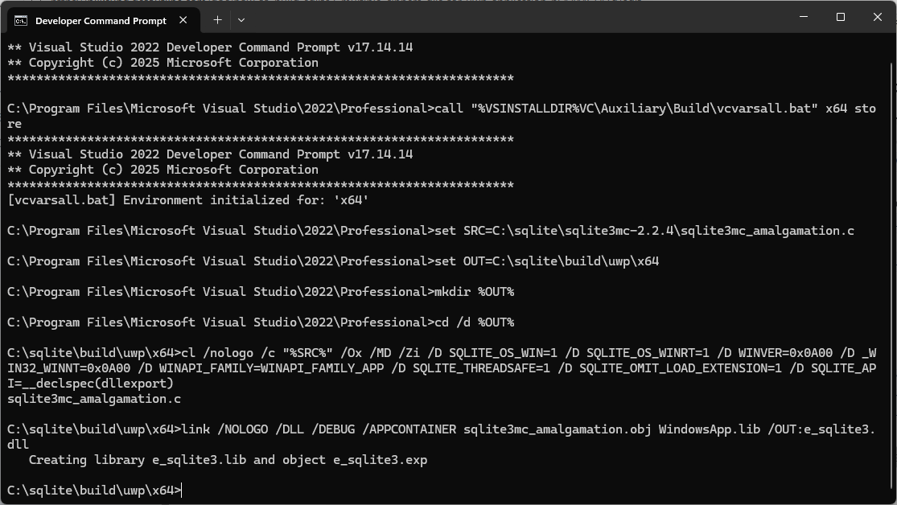
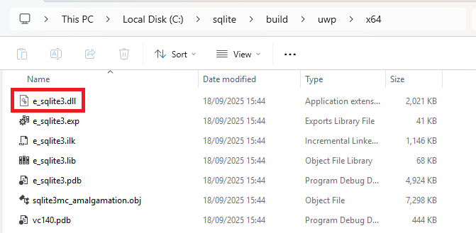
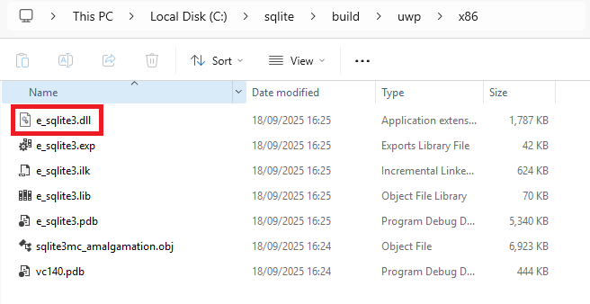
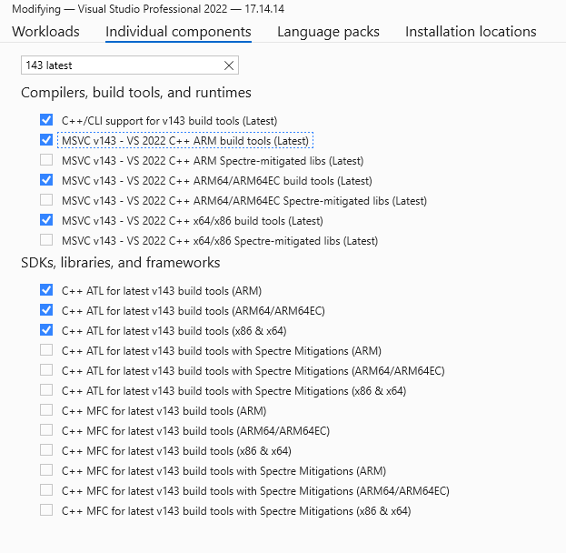
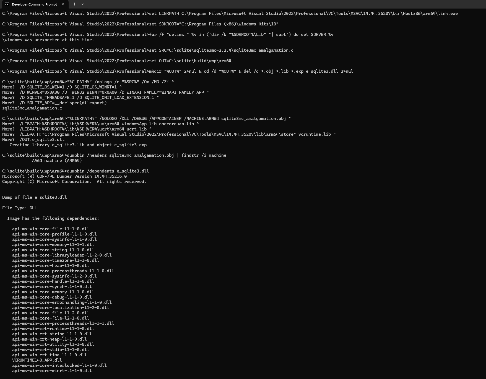
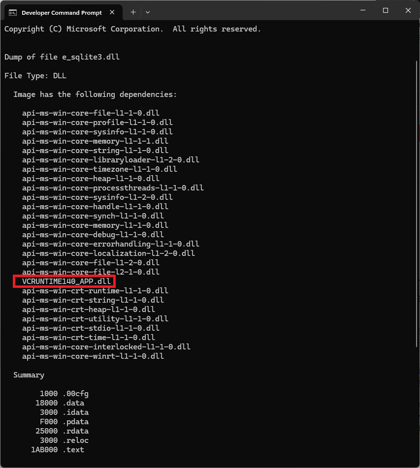
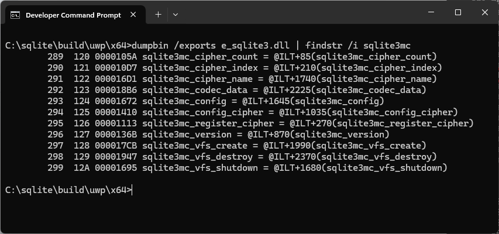

# How to build and use SQLite3 Multiple Ciphers DLLs for UWP Application

## Goal

Make `e_sqlite3.dll` for UWP **x64,x86, ARM64, ARM** based on [SQLite3MultipleCiphers](https://github.com/utelle/SQLite3MultipleCiphers) (for example, version 2.2.4), which embeds [SQLite](https://sqlite.org/) (for example, version 3.50.4).\n

The DLL must link to the UWP CRT instead of the desktop CRT.

\nAfter that, integrate it into the UWP app and tests, and verify that both SQLite3MultipleCiphers and SQLite are active and working correctly.


## Prerequisite


1. Visual Studio 2022 with C++ build tools and UWP workload.
2. **MSVC v143 C++ ARM64 build tools**
3. **MSVC v143 C++ ARM build tools**
4. Windows 10 SDK 18362 or newer.
5. Make a working folder:`C:\sqlite\ `
6. Download **SQLite3MultipleCiphers v2.2.4** source zip from: <https://github.com/utelle/SQLite3MultipleCiphers/releases/download/v2.2.4/sqlite3mc-2.2.4-sqlite-3.50.4-amalgamation.zip>\n\n\nSave it to `C:\sqlite\`.\n
7. Extract it to:

   `C:\sqlite\sqlite3mc-2.2.4\ `\n

   Make sure this file exists after extraction:

   `C:\sqlite\sqlite3mc-2.2.4\sqlite3mc_amalgamation.c `\n\n


:::tip
Tip: You don't need the SQLite official source zip for this path. \nThe sqlite3mc amalgamation already bundles the core that matches SQLite 3.50.4.

:::


## Build the **x64** UWP DLL

* Open **Developer Command Prompt for VS 2022**.
* Switch to the UWP store toolchain for **x64**:

  `call "%VSINSTALLDIR%VC\Auxiliary\Build\vcvarsall.bat" x64 store`
* The result must show: `[vcvarsall.bat] Environment initialized for: 'x64'`
* Run these commands one by one:\n`set SRC=C:\sqlite\sqlite3mc-2.2.4\sqlite3mc_amalgamation.c`\n\n`set OUT=C:\sqlite\build\uwp\x64`\n\n`mkdir %OUT% `\n\n`cd /d %OUT%`\n\n`cl /nologo /c "%SRC%" /Ox /MD /Zi /D SQLITE_OS_WIN=1 /D SQLITE_OS_WINRT=1 /D WINVER=0x0A00 /D _WIN32_WINNT=0x0A00 /D WINAPI_FAMILY=WINAPI_FAMILY_APP /D SQLITE_THREADSAFE=1 /D SQLITE_OMIT_LOAD_EXTENSION=1 /D SQLITE_API=__declspec(dllexport)`\n

  `link /NOLOGO /DLL /DEBUG /APPCONTAINER sqlite3mc_amalgamation.obj WindowsApp.lib /OUT:e_sqlite3.dll`\n\n\n
* Optional features, add them at the compile step, for example:

  `/D SQLITE_ENABLE_JSON1 /D SQLITE_ENABLE_FTS5`\n
* You will see the result with `e_sqlite3.dll` at `C:\sqlite\build\uwp\x64`\n


## Build the **x86** UWP DLL

* Open **Developer Command Prompt for VS 2022**.
* Switch to the UWP store toolchain for **x86**:

  `call "%VSINSTALLDIR%VC\Auxiliary\Build\vcvarsall.bat" x86 store`
* The result must show: `[vcvarsall.bat] Environment initialized for: 'x86'`
* Run these commands one by one:\n`set SRC=C:\sqlite\sqlite3mc-2.2.4\sqlite3mc_amalgamation.c`\n\n`set OUT=C:\sqlite\build\uwp\x86`\n\n`mkdir %OUT% `\n\n`cd /d %OUT%`\n\n`cl /nologo /c "%SRC%" /Ox /MD /Zi /D SQLITE_OS_WIN=1 /D SQLITE_OS_WINRT=1 /D WINVER=0x0A00 /D _WIN32_WINNT=0x0A00 /D WINAPI_FAMILY=WINAPI_FAMILY_APP /D SQLITE_THREADSAFE=1 /D SQLITE_OMIT_LOAD_EXTENSION=1 /D SQLITE_API=__declspec(dllexport)`\n

  `link /NOLOGO /DLL /DEBUG /APPCONTAINER sqlite3mc_amalgamation.obj WindowsApp.lib /OUT:e_sqlite3.dll`\n\n
* Optional features, add them at the compile step, for example:

  `/D SQLITE_ENABLE_JSON1 /D SQLITE_ENABLE_FTS5`\n
* You will see the result with `e_sqlite3.dll` at `C:\sqlite\build\uwp\x64`

  

  \

## Build the **ARM64** UWP DLL

Make sure you installed the: **MSVC v143 C++ ARM64 build tools for Visual Studio 2022**

 


```bash
set CLPATH=C:\Program Files\Microsoft Visual Studio\2022\Professional\VC\Tools\MSVC\14.44.35207\bin\Hostx86\arm64\cl.exe
set LINKPATH=C:\Program Files\Microsoft Visual Studio\2022\Professional\VC\Tools\MSVC\14.44.35207\bin\Hostx86\arm64\link.exe
set SDKROOT="C:\Program Files (x86)\Windows Kits\10"
for /f "delims=" %v in ('dir /b "%SDKROOT%\Lib" ^| sort') do set SDKVER=%v

set SRC=C:\sqlite\sqlite3mc-2.2.4\sqlite3mc_amalgamation.c
set OUT=C:\sqlite\build\uwp\arm64

mkdir "%OUT%" 2>nul & cd /d "%OUT%" & del /q *.obj *.lib *.exp e_sqlite3.dll 2>nul

"%CLPATH%" /nologo /c "%SRC%" /Ox /MD /Zi ^
 /D SQLITE_OS_WIN=1 /D SQLITE_OS_WINRT=1 ^
 /D WINVER=0x0A00 /D _WIN32_WINNT=0x0A00 /D WINAPI_FAMILY=WINAPI_FAMILY_APP ^
 /D SQLITE_THREADSAFE=1 /D SQLITE_OMIT_LOAD_EXTENSION=1 ^
 /D SQLITE_API=__declspec(dllexport)

"%LINKPATH%" /NOLOGO /DLL /DEBUG /APPCONTAINER /MACHINE:ARM64 sqlite3mc_amalgamation.obj ^
 /LIBPATH:%SDKROOT%\lib\%SDKVER%\um\arm64 WindowsApp.lib onecoreuap.lib ^
 /LIBPATH:%SDKROOT%\lib\%SDKVER%\ucrt\arm64 ucrt.lib ^
 /LIBPATH:"C:\Program Files\Microsoft Visual Studio\2022\Professional\VC\Tools\MSVC\14.44.35207\lib\arm64\store" vcruntime.lib ^
 /OUT:e_sqlite3.dll

dumpbin /headers sqlite3mc_amalgamation.obj | findstr /i machine
dumpbin /dependents e_sqlite3.dll
```

You want:

* `AA646 machine (ARM64)` for the object
* `vcruntime140_app.dll` in the DLL dependents

 

## Build the **ARM** UWP DLL

Make sure you installed the: **MSVC v143 C++ ARM build tools for Visual Studio 2022**


 


\
```bash
call "C:\Program Files\Microsoft Visual Studio\2022\Professional\VC\Auxiliary\Build\vcvarsall.bat" amd64_arm store
set SRC=C:\sqlite\sqlite3mc-2.2.4\sqlite3mc_amalgamation.c
set OUT=C:\sqlite\build\uwp\arm
set SDKROOT=%ProgramFiles(x86)%\Windows Kits\10
set SDKVER=10.0.19041.0

mkdir "%OUT%" 2>nul & cd /d "%OUT%" & del /q *.obj *.lib *.exp e_sqlite3.dll 2>nul

cl /nologo /c "%SRC%" /Ox /MD /Zi ^
 /D SQLITE_OS_WIN=1 /D SQLITE_OS_WINRT=1 ^
 /D WINVER=0x0A00 /D _WIN32_WINNT=0x0A00 /D WINAPI_FAMILY=WINAPI_FAMILY_APP ^
 /D SQLITE_THREADSAFE=1 /D SQLITE_OMIT_LOAD_EXTENSION=1 ^
 /D SQLITE_API=__declspec(dllexport)
 
 link /NOLOGO /DLL /DEBUG /APPCONTAINER /MACHINE:ARM sqlite3mc_amalgamation.obj ^
 /LIBPATH:"%ProgramFiles(x86)%\Windows Kits\10\Lib\10.0.19041.0\um\arm" WindowsApp.lib onecoreuap.lib uuid.lib ^
 /LIBPATH:"%ProgramFiles(x86)%\Windows Kits\10\Lib\10.0.19041.0\ucrt\arm" ucrt.lib ^
 /LIBPATH:"%VCToolsInstallDir%lib\arm\store" vcruntime.lib ^
 /OUT:e_sqlite3.dll

dumpbin /headers sqlite3mc_amalgamation.obj | findstr /i machine
dumpbin /dependents e_sqlite3.dll
```

You want:

* `1C4 machine (ARM)` for the object
* `vcruntime140_app.dll` in the DLL dependents


## How to verify if the DLLs are built with the correct SQLite3MultipleCiphers and SQLite version.


* CD to the x64 or x86 folder:\n`cd C:\sqlite\build\uwp\x64` or `cd C:\sqlite\build\uwp\x86`

  \
* Run

  `dumpbin /dependents e_sqlite3.dll`\n
* You must see `VCRUNTIME140_APP.dll`.\nIf you see `VCRUNTIME140.dll`, you are building the desktop version, try to carefully start again with the "store toolchain" step.\n\n\n
* Run

  `dumpbin /exports e_sqlite3.dll | findstr /i sqlite3mc`\n
* You must see `sqlite3mc_…` functions there:\n\n


## Add the DLLs to your UWP app project


1. Put the files in your repo:

   `MyUWP\native\x64\e_sqlite3.dll `\n`MyUWP\native\x86\e_sqlite3.dll `\n

   Edit your app `.csproj` and add:

```csharp
<ItemGroup Condition="'$(Platform)'=='x64'">
  <Content Include="native\x64\e_sqlite3.dll">
    <CopyToOutputDirectory>PreserveNewest</CopyToOutputDirectory>
    <TargetPath>e_sqlite3.dll</TargetPath>
  </Content>
</ItemGroup>
<ItemGroup Condition="'$(Platform)'=='x86'">
  <Content Include="native\x86\e_sqlite3.dll">
    <CopyToOutputDirectory>PreserveNewest</CopyToOutputDirectory>
    <TargetPath>e_sqlite3.dll</TargetPath>
  </Content>
</ItemGroup>
```


2. Add the UWP VC++ runtime extensions to the project:
   * Microsoft Visual C++ 2015–2022 Runtime for UWP Apps
   * Microsoft Visual C++ 2015–2022 Debug Runtime for UWP Apps

Repeat the same steps in your UWP test project if it uses the DLL.

## Add/Update the nuget packages in the UWP app

`<PackageReference Include="SQLitePCLRaw.core" Version="3.0.2" /> `

`<PackageReference Include="SQLitePCLRaw.config.e_sqlite3" Version="3.0.2" /> `

`<PackageReference Include="sqlite-net-base" Version="1.9.172" />`

Do not add another SQLitePCLRaw bundle.

## App init and open policy

Call this once at app start:

`SQLitePCL.Batteries_V2.Init();`

\nWe can use different encryption cipher schemes, for example, SQLCipher version 3 :

```csharp
    private static SQLiteConnection BuildConnectionString(string path, string key) =>
        new SQLiteConnection(new SQLiteConnectionString(
            path,
            storeDateTimeAsTicks: true,
            key: key,
            preKeyAction: c =>
            {
                _ = c.ExecuteScalar<string>("PRAGMA cipher='sqlcipher'");
                _ = c.ExecuteScalar<long>("PRAGMA legacy=3");
            }));
```

## Unit tests to verify

```csharp

using System;
using System.Collections.Generic;
using System.IO;
using System.Threading.Tasks;
using SQLite;
using Xunit;

/// <summary>
/// Provides unit tests for verifying the functionality of SQLite3 with multiple ciphers enabled.
/// </summary>
public sealed class SQLite3MultipleCiphersTests : IDisposable
{
    private const string TestDbPassphrase = "unit-test-passphrase";
    private readonly string dbPath;

    public SQLite3MultipleCiphersTests()
    {
        SQLitePCL.Batteries_V2.Init();
        this.dbPath = Path.Combine(Path.GetTempPath(), "sqlite3mc_test.sqlite");

        // Delete any existing temp DB file
        this.CleanupTempDB();

        // Create encrypted DB, create table, insert rows
        using var dbConnection = BuildConnectionString(this.dbPath, TestDbPassphrase);
        dbConnection.CreateTable<Item>();
        dbConnection.InsertAll(new[]
        {
            new Item { Name = "alpha" },
            new Item { Name = "beta" },
            new Item { Name = "gamma" },
        });

        var saved = dbConnection.Table<Item>().Count();
        Assert.Equal(3, saved);
    }

    public void Dispose()
    {
        this.CleanupTempDB();
    }

    [Fact]
    public void SqliteVersion_MustBeExpectedVersion()
    {
        var version = SQLitePCL.raw.sqlite3_libversion().utf8_to_string();

        // The version here must be 30.5.4 or higher, as that is the version fixed CVE-2025-6965.
        Assert.Equal("3.50.4", version);
    }

    [Fact]
    public void SQLite3MultipleCiphers_IsPresent()
    {
        using var dbConnection = new SQLiteConnection(":memory:");

        // sqlite3mc specific function, stock SQLite will throw "no such function"
        var version = dbConnection.ExecuteScalar<string>("select sqlite3mc_version()");

        Assert.Equal("SQLite3 Multiple Ciphers 2.2.4", version);
    }

    [Fact]
    public void SQLite3MultipleCiphers_ConnectWithoutKey_ThrowException()
    {
        Assert.Throws<SQLiteException>(() =>
        {
            using var c = new SQLiteConnection(new SQLiteConnectionString(this.dbPath, true)); // no key
            var rows = c.Table<Item>().OrderBy(i => i.Id).ToList();
        });
    }

    [Fact]
    public void SQLite3MultipleCiphers_ConnectWithKey_CanReadBack_AndIntegrityIsOk()
    {
        using var dbConnection = BuildConnectionString(this.dbPath, TestDbPassphrase);

        // Read back the rows
        var rows = dbConnection.Table<Item>().OrderBy(i => i.Id).ToList();
        Assert.Equal(3, rows.Count);
        Assert.Collection(
            rows,
            r => Assert.Equal("alpha", r.Name),
            r => Assert.Equal("beta", r.Name),
            r => Assert.Equal("gamma", r.Name));

        // Targeted query
        var betas = dbConnection.Table<Item>().Where(i => i.Name == "beta").ToList();
        Assert.Single(betas);
        Assert.Equal("beta", betas[0].Name);

        // Integrity check
        var integrity = dbConnection.ExecuteScalar<string>("pragma integrity_check");
        Assert.Equal("ok", integrity);
    }

    private static SQLiteConnection BuildConnectionString(string path, string key) =>
        new SQLiteConnection(new SQLiteConnectionString(
            path,
            storeDateTimeAsTicks: true,
            key: key,
            preKeyAction: c =>
            {
                _ = c.ExecuteScalar<string>("PRAGMA cipher='sqlcipher'");
                _ = c.ExecuteScalar<long>("PRAGMA legacy=3");
            }));

    private void CleanupTempDB()
    {
        try
        {
            if (File.Exists(this.dbPath))
            {
                File.Delete(this.dbPath);
            }
        }
        catch
        {
            Console.WriteLine("Failed to delete temp DB file: " + this.dbPath);
        }
    }

    private class Item
    {
        [PrimaryKey]
        [AutoIncrement]
        public int Id { get; set; }

        public string Name { get; set; }
    }
}
```
